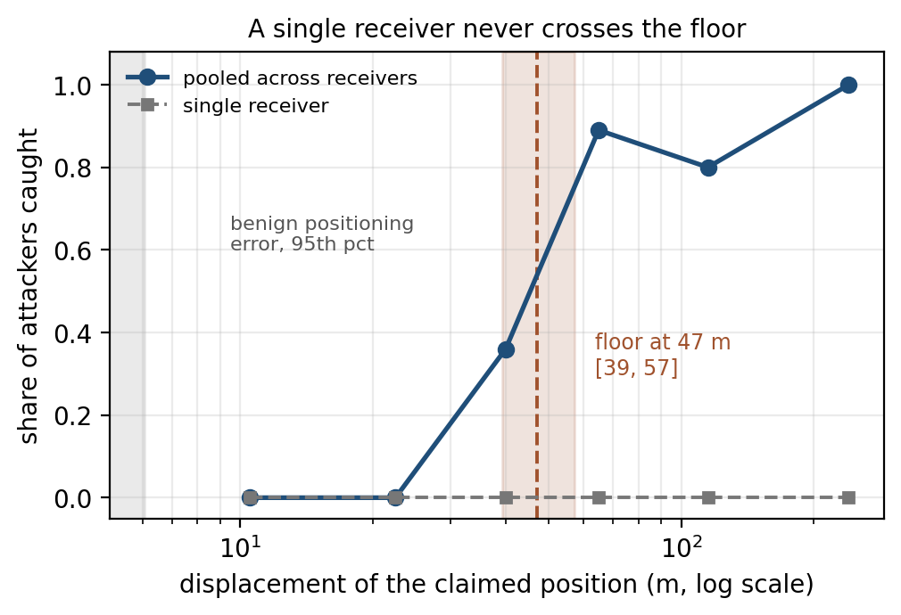
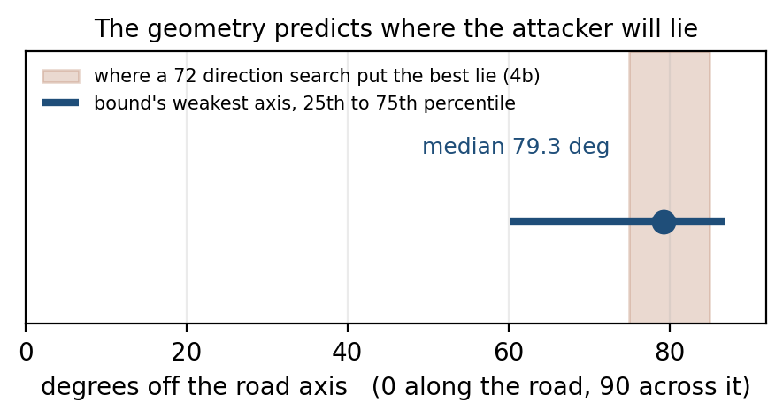

# Cybersecurity for Connected Cars: Edge-Based Federated Intrusion Detection

A labelled C-V2X sidelink intrusion detection dataset and the cross-layer
detection pipeline built on it.

Connected vehicles broadcast safety messages several times a second carrying
position, speed and heading. Those messages are signed: ETSI TS 103 097 wraps
every one of them in an ECDSA signature under a pseudonym certificate, and IEEE
1609.2 does the same in North America. What the signature establishes is that
the message came from a credentialled station and was not altered in transit. It
establishes nothing about whether the position inside it is true, so a station
holding valid credentials can transmit a correctly signed message whose contents
are false and no receiver can tell from the cryptography alone. This work
generates such misbehaviour in simulation, records only what a receiver could
actually observe, and evaluates detection from the application layer, the radio
layer and the two combined.

---

## The dataset

Generated with NS-3.42 and the 5G-LENA `nr` module at tag `v2x-1.1`. Vehicles
exchange messages directly over an NR V2X Mode 2 PC5 sidelink.

| Property | Value |
|---|---|
| Road | 6 km, three lanes each way, 90 vehicles, 12 roadside units |
| Mobility | Intelligent Driver Model car following, three vehicle classes |
| Benign traffic | ETSI CAM, DENM, CPM and VAM, each from its own triggering conditions, under TS 102 687 reactive congestion control |
| Seeds | 8, each 60 s |
| Windows | 1,641,002 |
| Stations | 720, of which 519 benign |
| Classes | 11, being benign and ten misbehaviour types |
| Features | 50, being 22 application layer and 28 physical and MAC layer |
| Benign positioning error | median 4.00 m, 95th percentile 5.90 m |
| Detection unit | one observer's view of one claimed station over one time window |

**Benign vehicles do not claim their exact position.** Each carries a receiver
error drawn from the model VeReMi Extension uses: a per-vehicle bias, a small
correlated component, and occasional multipath excursions. Without it the
benign class has no positional variance and any displacement at all is
separable in principle, which makes a position attack easier to detect than it
could ever be in deployment.

**Misbehaviour types.** Position falsification at three magnitudes, 20 to 25 m,
47 to 60 m and 71 to 233 m, plus random position offset, replayed position,
speed falsification, sybil, high-rate denial of service, low-rate denial of
service, and sensing manipulation.

The three position magnitudes are one mechanism at different scales, chosen
against the benign error so that the set brackets the point at which detection
becomes possible rather than sitting to one side of it. Their realised
displacements do not overlap.

**Ground truth never travels over the air.** The transmitter logs it, the
receiver logs only what it received, and the two are joined offline on a message
identifier. `build_features.py` opens only the receive-side tables, and an
assertion fails the run if any column named `key_*` or `label_*` reaches the
feature list. A feature that a real receiver could not compute cannot enter the
dataset by accident.

**A limit worth stating up front.** Mode 2 resource grants in 5G-LENA are data
driven, so a reserved resource is only used when there is data for it and no
attacker can hoard the channel. Sensing manipulation therefore produces no
signature. That is a property of the simulator rather than of C-V2X, and it is
why the cross-layer argument rests on radio features catching application-layer
misbehaviour.

---

## What it shows

Four results, in the order they build. Every number here is pinned to the log
that produced it by `analysis/verify_results.py`, which checks 134 figures and
must report no failures.

**A single receiver cannot see a position lie.** Not at any magnitude this
dataset contains. On the three constant-offset classes the best score reached by
any of four learner families, being a random forest, gradient boosting, an MLP
and logistic regression over identical rows and folds, is 0.010, 0.052 and 0.167.
That is not one model failing. The measurement model itself is the reason: it has
four free parameters, two of position and two of propagation, and one receiver
supplies one equation per window at the same geometry every time.

**Pooling received power across receivers recovers it, and there is a floor.**
Detection against displacement crosses 50 percent at **47.2 m**, with a 95
percent interval of 39.3 to 57.4 m, measured on a campaign built to sample the
transition rather than inferred from the ends of a curve.



**The geometry predicts where an attacker will lie.** Receivers strung along a
straight road are close to collinear, so the error ellipse is long across the
road. An attacker who understands the estimator should lie along that weak axis,
and one found by brute-force search over 72 directions does, at 75 to 85 degrees
off the road axis. Constraining the fit to the carriageway removes that axis and
takes localisation error from 65 m to 18 m.



**It holds on somebody else's data.** Run against VeReMi NextGen, the current
public benchmark, the same detector scores 0.9570 on a self-inconsistent position
lie, 0.1460 on a self-consistent constant offset, and 0.0352 on the constant
offsets here. The ordering reproduces and is sharper there. NextGen carries no
radio layer, so the cross-layer gap survives the comparison.

**On the headline classification numbers**, fused macro F1 is 0.5145 across all
eleven classes and 0.5659 across the ten that have a physical signature, with a
Matthews correlation of 0.6635. Those are not high scores and they are not meant
to be. A 1-NN classifier reaches only 0.3466 on this corpus, which is the
evidence that the task is not being won by memorisation, and the numbers fell
when benign vehicles were given realistic positioning error rather than being
allowed to claim their exact position.

---

## Pipeline

[`simulation/`](simulation/) is the ns-3 contrib module that generates the
traces. [`analysis/`](analysis/) takes them from raw simulator tables through to
results: windowing and feature extraction, ten adversarial integrity gates,
the cross-layer benchmark, cross-receiver position verification, the federated
aggregation panel, and the deployment evaluation.

Every split is grouped by transmitting station, false positive rate is reported
at true prevalence rather than on a balanced set, and detection latency counts
the time a window takes to fill rather than the forward pass alone. Aggregate
scores are reported as both macro F1 and the Matthews correlation, because the
two do not always agree and reporting one hides the disagreement.

The position estimate is fitted under a road constraint. Receivers strung along
a straight road are close to collinear, so range-only measurements barely
constrain position across it, and an unconstrained fit spends most of its
freedom in the one direction the measurements cannot resolve. Bounding that
coordinate to the carriageway takes localisation error from 65 m to 18 m and
closes the evasion an attacker who understands the estimator would otherwise
use.

---

## Reproducing

Build the simulation module and apply the one required patch to 5G-LENA, both
covered in [`simulation/README.md`](simulation/README.md). Generate seeds, then
take the finished campaign through every analysis stage in one pass:

```bash
./analysis/regenerate.sh <run-dir> <max-time-ms> seed1 seed2 ... seed8
```

Each stage writes its own log, so a single stage can be repeated after a fix
without redoing the work before it. Run `analysis/check_campaign.py` on the
first seed before letting the rest generate; it reads only the small transmit
table, exits non-zero on any problem it finds, and catches the
misconfigurations that are expensive to find afterwards. It checks the benign
positioning error is present and that the position attack magnitudes do not
overlap, both of which are cheap to verify on one seed and costly to discover
after eight.
[`analysis/README.md`](analysis/README.md) documents every script and the
methodology constraints the pipeline enforces.

**Requirements, exact versions and measured runtimes** are in
[`REPRODUCING.md`](REPRODUCING.md). Short version: ns-3 at the CTTC `v2x-1.1`
fork built under Python 3.12, analysis on Python 3.9, and the two interpreters
must not be mixed. Use an absolute interpreter path in anything you background,
because a background shell resolves `python3` differently from an interactive
one.

Traces are not held in the repository. They are regenerated from source.

---

## Repository layout

```
capstone-cv2x-ids/
├── simulation/                  # ns-3 contrib module
│   └── cv2xids/                 # ITS messaging, DCC, car following, attacks, traces
│
├── analysis/                    # detection pipeline
│   ├── build_features.py        # windowing, application and radio features
│   ├── validate_dataset.py      # ten adversarial integrity gates
│   ├── benchmark.py             # application against radio against fused
│   ├── pooled_consensus.py      # cross-receiver position verification
│   ├── offset_floor.py          # detection against displacement, and the floor
│   ├── drift.py                 # transfer to an unseen density or period
│   ├── power_evasion.py         # the adversary that knows how the detector works
│   ├── veremi_bridge.py         # the same detector on an independent dataset
│   ├── federated.py             # FedAvg, FedProx, FedNova, FedLC, FedProto, DP
│   ├── persistence_filter.py    # alert episodes and K-of-M operating points
│   └── regenerate.sh            # whole chain, one stage per log
│
├── docs/patches/                # additive patch to 5G-LENA, required to build
│
└── capstone/                    # earlier coursework material, archived
```

[`capstone/`](capstone/) holds the earlier RMIT coursework phase: a separate
simulation over a 5G uplink, its feature selection, classification and federated
learning workstreams, and the progress report. It is kept for reference and is
not used by anything above it. See [`capstone/README.md`](capstone/README.md).

---

## The dataset card

[`docs/DATASET_CARD.md`](docs/DATASET_CARD.md) is the document to read before
using the data: the five scenarios and what each varies, every class with its
vehicle count, the frozen partition, all 61 columns described, and the
limitations stated rather than left to be found. It is generated from the corpus
by `analysis/make_dataset_card.py`, so its counts cannot drift from the data, and
a column with no description fails the run rather than being quietly omitted.

---

## Licence

**GPL-2.0-only**, in [`LICENSE`](LICENSE). `simulation/cv2xids/` is an ns-3
contrib module and links against ns-3, so it is a derivative work of GPL-2.0-only
software and carries the same terms. That is an obligation rather than a
preference. [`LICENSES.md`](LICENSES.md) explains what covers what, records the
third-party components and their terms, and states the intent for the dataset
itself, which is not in this repository and which software licences are the wrong
instrument for.
