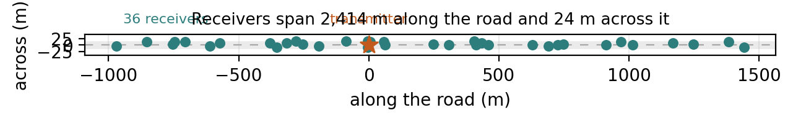

# CV2X-IDS

**A labelled dataset of vehicles lying to each other over C-V2X, and a study of
what a receiver can and cannot catch.**

RMIT engineering capstone, project P003859Eng, courses OENG1167 and OENG1168.
Supervisor A/Prof Ke (Desmond) Wang, research mentor Mr Kanwardeep Singh Gahlot.

---

## The problem

Cars now broadcast their position, speed and heading several times a second so
that the cars around them can brake, merge and warn each other. Those messages
are signed. ETSI TS 103 097 wraps every one in a cryptographic signature under a
pseudonym certificate, and IEEE 1609.2 does the same in North America.

**The signature proves who sent the message. It proves nothing about whether the
message is true.**

A car with perfectly valid credentials can broadcast a correctly signed message
saying it is forty metres from where it actually is, and no amount of
cryptography will catch it. Everything downstream believes it. A false position
in the wrong place is a phantom brake event, a missed merge, or a collision
warning that never fires.

So the question is not how to authenticate these messages. That problem is
solved. The question is **how a receiver decides whether a properly signed
message is telling the truth**, using only what a receiver actually has: what the
message said, and what the radio measured while receiving it.

This project builds the data to answer that, and then answers it.

## Where to go

| If you want to | Read |
|---|---|
| **train something on this data** | [`USING_THE_DATA.md`](USING_THE_DATA.md). You do not need to reproduce anything |
| **pick up one of the open pieces of work** | [`HANDOFF.md`](HANDOFF.md) |
| see the idea in ninety seconds | [`docs/booth/index.html`](docs/booth/index.html), open it in a browser |
| know what every class and column means | [`docs/DATASET_CARD.md`](docs/DATASET_CARD.md) |
| rebuild the dataset from the simulator, which almost nobody needs | [`REPRODUCING.md`](REPRODUCING.md) |
| understand the detection pipeline | [`analysis/README.md`](analysis/README.md) |

`docs/booth/index.html` is *Catch Me Lying*, a self-contained interactive demo
that puts you in the attacker's seat: choose where to claim you are, and watch
whether the receivers catch you. It is a single file with no server and no build
step. [`docs/booth/poster.html`](docs/booth/poster.html) is the A0 poster that
goes beside it, also a single file, laid out in millimetres so it prints at the
size it was designed at.

---

## What we found

Four results. Every number below is pinned to the log line that produced it by
`analysis/verify_results.py`, which checks 158 figures and must report no
failures.

### 1. A single receiver cannot see a position lie

Not at any magnitude in this dataset. Four learner families were run over
identical rows and folds: a random forest, gradient boosting, a neural network
and logistic regression. On the three constant-offset position classes the best
score any of them reached is **0.010, 0.052 and 0.167**.

That is not four models failing. The measurement itself is the reason. A receiver
estimating where a transmitter really is has four unknowns to solve for, two of
position and two describing how the signal fades with distance, and a single
receiver sitting at the same geometry every window supplies one equation. The
information is not there to be found.

### 2. Receivers pooling what they heard can see it, down to a floor

Combine the received power several receivers measured for the same transmitter
and the position becomes checkable. Detection against displacement crosses 50
percent at **47.2 m**, with a 95 percent interval of 39.3 to 57.4 m.

So there is a band of lies too small to catch and a band large enough to catch,
and the boundary can be measured rather than guessed.


### 3. The geometry tells you where an attacker will lie

Roadside receivers strung along a straight road are nearly in a line, and that is
not a small effect. For a typical transmitter the receivers that hear it spread
2,414 m along the road and 24 m across it, which is a hundred to one.



A hundred-to-one array is poor at resolving position *across* the road, because
every receiver is measuring from roughly the same direction. Working that out
from the geometry alone predicts the error ellipse points **79.3 degrees** off
the road axis. An attacker found independently by brute-force search over 72 directions
lies at **75 to 85 degrees**, with no knowledge of the prediction.

The countermeasure follows from the same reasoning. Constraining the position
estimate to the carriageway removes the direction the receivers cannot resolve,
and takes localisation error from 65 m to 18 m.


### 4. It holds on somebody else's data

Run against VeReMi NextGen, the current public benchmark, the same detector
scores 0.9570 on a position lie that contradicts itself, 0.1460 on a
self-consistent constant offset, and 0.0352 on the constant offsets here. The
ordering reproduces on an independently generated dataset and is sharper there.

### On the headline number, which is 0.5145

Fused macro F1 is **0.5145** across all eleven classes, 0.5659 across the ten
that have a physical signature, with a Matthews correlation of 0.6635.

**That is a low number and it is the right one.** Three things put it there.

Benign vehicles carry a realistic positioning error, median 4.00 m, so a claimed
position is checked against a benign class that genuinely varies rather than
against vehicles that always know exactly where they are. An eleventh class sits
in the magnitude band where detection is hardest, deliberately. And every split is
grouped by physical transmitter, so no vehicle appears on both sides.

The check that the task is not trivial is that a 1-nearest-neighbour classifier
reaches only **0.3466** here. A dataset a nearest-neighbour lookup can solve is a
dataset that has been memorised rather than learned.

---

## How this project got here

This is worth knowing before reading anything else, because it explains why the
work is built the way it is.

An earlier version of this project reported a macro F1 of **1.0000**. Three
different model families all scored a perfect 1.0000, and a federated version of
the same model did too. That looked like success for several weeks.

It was a defect. An audit found that **96.39 percent of the test rows appeared
verbatim in the training set**, that a 1-nearest-neighbour classifier scored
1.0000 on it, and that 16,150 benign windows collapsed to a single distinct
feature vector while the distance they were supposedly measuring ranged from 2 m
to over 8 km. Several features differenced a claimed value against the
simulator's own ground truth, which is a number no roadside unit has.

The perfect score was not an achievement. It was the symptom.

So the pipeline was rebuilt from the simulator upward, over a direct
vehicle-to-vehicle sidelink rather than an uplink to a server, with realistic
mobility, standards-compliant message triggering, benign positioning error, and a
structural guarantee that ground truth cannot reach the feature list. The honest
number is 0.5145.

Two things were kept from that experience and they shape everything here.

**Validation is adversarial rather than confirmatory.** The old pipeline ran 57
integrity checks and passed all 57, because they checked what the generator
intended. The current gates try to *show the dataset is trivial*, and the run
fails if any of them succeeds: duplicate rows at measurement precision, verbatim
train and test overlap, nearest-neighbour triviality, single-feature
separability, correlation with any ground-truth column. Ten gates, and they are
written to be failed.

**Every reported number is pinned to its log.** `verify_results.py` ties each of
155 figures to the exact line of the run log that produced it and fails if either
side is edited alone. Five conclusions in this project have been withdrawn when
the evidence moved, which is only possible because the evidence and the claims
are mechanically tied together.

---

## The dataset

Generated with ns-3.42 and the 5G-LENA `nr` module at tag `v2x-1.1`. Vehicles
exchange messages directly over an NR V2X Mode 2 PC5 sidelink, which is
vehicle-to-vehicle radio with no base station involved.

| Property | Value |
|---|---|
| Road | 6 km, three lanes each way, 90 vehicles, 12 roadside units |
| Mobility | Intelligent Driver Model car following, three vehicle classes |
| Benign traffic | ETSI CAM, DENM, CPM and VAM, each from its own triggering conditions, under TS 102 687 reactive congestion control |
| Seeds | 8, each 60 s |
| Windows | 1,641,002 in this scenario, 7,916,708 across the five released |
| Stations | 720, of which 519 benign |
| Classes | 11, being benign and ten misbehaviour types |
| Features | 50, being 22 application layer and 28 physical and MAC layer |
| Benign positioning error | median 4.00 m, 95th percentile 5.90 m |
| Detection unit | one observer's view of one claimed station over one time window |

The table describes `highway_sparse`, the reference scenario every headline
figure is measured on. The release ships five scenarios, each varying one factor
against that reference, under a single partition assigned across all of them.

**Misbehaviour types.** Position falsification at three magnitudes, 20 to 25 m,
47 to 60 m and 71 to 233 m, plus random position offset, replayed position, speed
falsification, sybil, high-rate denial of service, low-rate denial of service, and
sensing manipulation.

The three position magnitudes are one mechanism at different scales, chosen
against the benign error so that the set brackets the point at which detection
becomes possible rather than sitting to one side of it. Their realised
displacements do not overlap.

**Benign vehicles do not claim their exact position.** Each carries a receiver
error drawn from the model VeReMi Extension uses: a per-vehicle bias, a small
correlated component, and occasional multipath excursions. Without it the benign
class has no positional variance and any displacement at all is separable in
principle, which makes a position attack easier to detect than it could ever be in
deployment.

**Ground truth never travels over the air.** The transmitter logs it, the receiver
logs only what it received, and the two are joined offline on a message
identifier. `build_features.py` opens only the receive-side tables, and an
assertion fails the run if any column named `key_*` or `label_*` reaches the
feature list. A feature that a real receiver could not compute cannot enter the
dataset by accident.

**A limit worth stating up front.** Mode 2 resource grants in 5G-LENA are data
driven, so a reserved resource is only used when there is data for it and no
attacker can hoard the channel. Sensing manipulation therefore produces no
signature, and scores zero in every block on every corpus generated. That is a
property of the simulator rather than of C-V2X.

---

## Pipeline

[`simulation/`](simulation/) is the ns-3 contrib module that generates the traces.
[`analysis/`](analysis/) takes them from raw simulator tables through to results.

The six scripts that matter most, if you are reading the code for the first time:

| | |
|---|---|
| `baseline_starter.py` | where to start if you are training something. The protocol is already correct in it |
| `build_features.py` | windowing, and the 50 application and radio features |
| `validate_dataset.py` | the ten adversarial integrity gates |
| `benchmark.py` | application against radio against fused, the 0.5145 |
| `pooled_consensus.py` | cross-receiver position verification, result 2 |
| `geometry_bound.py` | the Cramer-Rao bound and the error ellipse, result 3 |

Every split is grouped by transmitting station, false positive rate is reported at
true prevalence rather than on a balanced set, and detection latency counts the
time a window takes to fill rather than the forward pass alone. Aggregate scores
are reported as both macro F1 and the Matthews correlation, because the two do not
always agree and reporting one hides the disagreement.

[`analysis/README.md`](analysis/README.md) documents every script and the
methodology constraints the pipeline enforces.

---

## Reproducing

Most people do not need this. If you want to use the data, see
[`USING_THE_DATA.md`](USING_THE_DATA.md) instead.

Build the simulation module and apply the one required patch to 5G-LENA, both
covered in [`simulation/README.md`](simulation/README.md). Generate seeds, then
take the finished campaign through every analysis stage in one pass:

```bash
./analysis/regenerate.sh <run-dir> <max-time-ms> seed1 seed2 ... seed8
```

Each stage writes its own log, so a single stage can be repeated after a fix
without redoing the work before it. Run `analysis/check_campaign.py` on the first
seed before letting the rest generate. It reads only the small transmit table,
exits non-zero on any problem it finds, and catches the misconfigurations that are
expensive to find after eight seeds: that the benign positioning error is present,
and that the position attack magnitudes do not overlap.

**Requirements, exact versions and measured runtimes** are in
[`REPRODUCING.md`](REPRODUCING.md). Short version: ns-3 at the CTTC `v2x-1.1` fork
built under Python 3.12, analysis on Python 3.9, and the two interpreters must not
be mixed.

Traces are not held in the repository. They are regenerated from source.

---

## Repository layout

```
capstone-cv2x-ids/
├── USING_THE_DATA.md            # start here to train something
├── HANDOFF.md                   # the two open pieces of work
│
├── simulation/                  # ns-3 contrib module
│   └── cv2xids/                 # ITS messaging, DCC, car following, attacks, traces
│
├── analysis/                    # detection pipeline, 42 scripts
│   ├── baseline_starter.py      # start here to train something
│   ├── build_features.py        # windowing, application and radio features
│   ├── validate_dataset.py      # ten adversarial integrity gates
│   ├── benchmark.py             # application against radio against fused
│   ├── pooled_consensus.py      # cross-receiver position verification
│   ├── geometry_bound.py        # the Cramer-Rao bound and the error ellipse
│   ├── verify_results.py        # every reported figure against its log
│   └── regenerate.sh            # whole chain, one stage per log
│
└── docs/
    ├── DATASET_CARD.md          # every class, every column, the limitations
    ├── figures/                 # the published figures
    └── patches/                 # additive patch to 5G-LENA, required to build
```

---

## The dataset card

[`docs/DATASET_CARD.md`](docs/DATASET_CARD.md) is the document to read before
using the data: the five scenarios and what each varies, every class with its
vehicle count, the frozen partition, all 61 columns described, and the limitations
stated rather than left to be found. It is generated from the corpus by
`analysis/make_dataset_card.py`, so its counts cannot drift from the data, and a
column with no description fails the run rather than being quietly omitted.

---

## The earlier coursework phase

The first version of this project, described above, is not in the working tree.
Leaving it beside the corrected work invited its numbers to be read as current. It
is kept in full and retrieved with:

```bash
git checkout part-a-archived -- capstone
```

`v1-parta-frozen` marks the same work as submitted in June 2026, before 508
further files were added to it.

---

## Licence

**GPL-2.0-only**, in [`LICENSE`](LICENSE). `simulation/cv2xids/` is an ns-3
contrib module and links against ns-3, so it is a derivative work of GPL-2.0-only
software and carries the same terms. That is an obligation rather than a
preference. [`LICENSES.md`](LICENSES.md) explains what covers what, records the
third-party components and their terms, and states the intent for the dataset
itself, which is not in this repository and which software licences are the wrong
instrument for.
