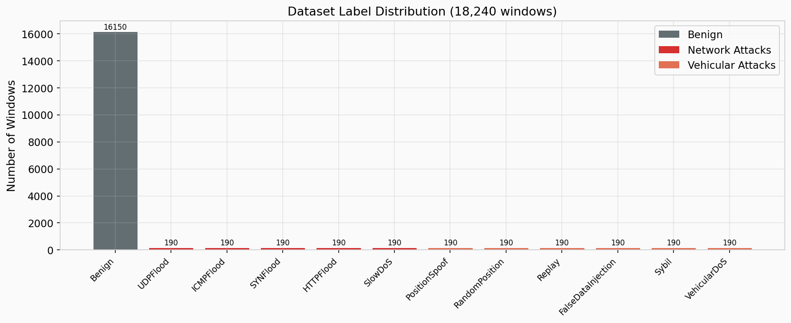
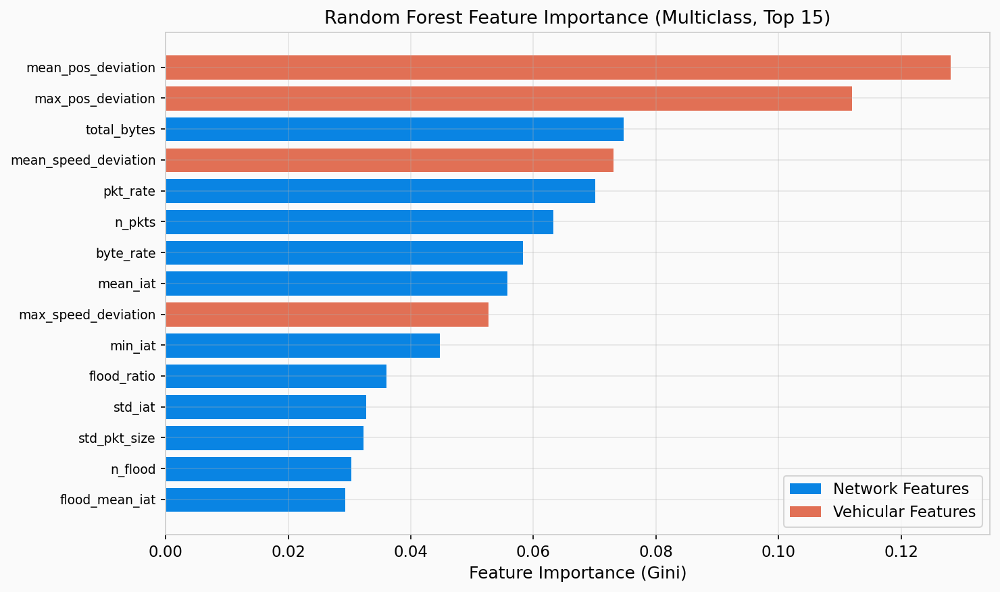
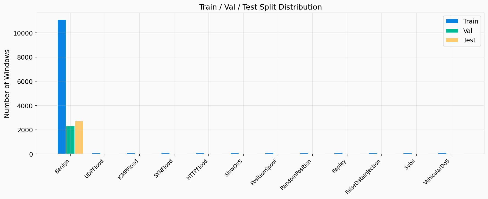
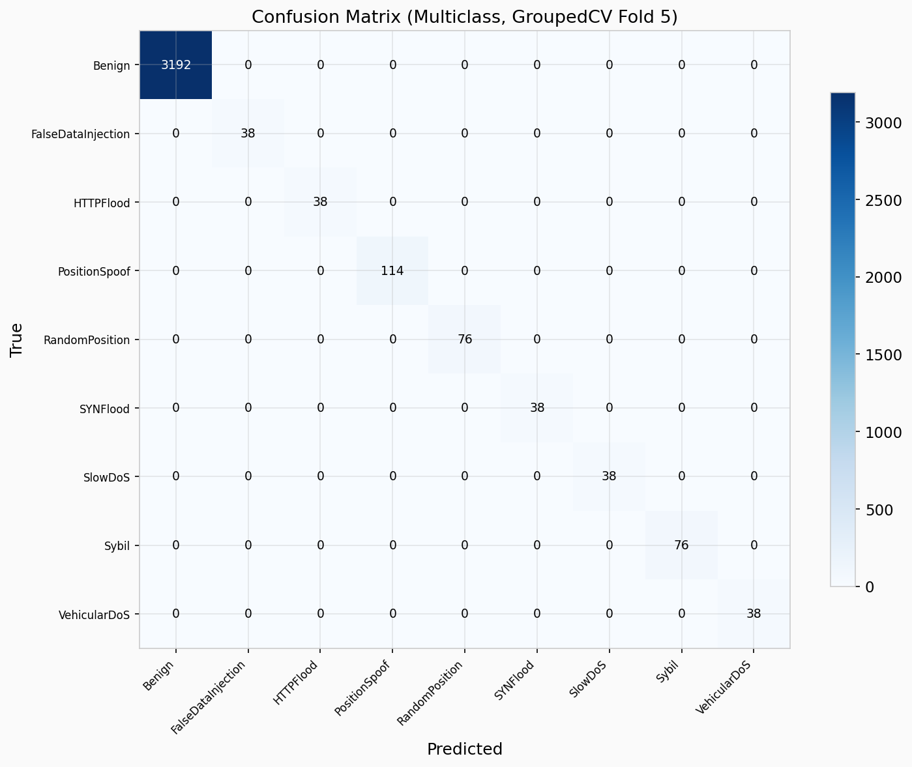

# CV2X-IDS Dataset: Verification and Baseline Results

## What Was Built

A simulation-based IDS dataset for 5G C-V2X (connected cars) edge-based intrusion detection, generated using NS-3.42 with the 5G-LENA NR module. Contains **18,240 time-windowed feature vectors** across **12 scenarios** (1 benign + 5 network attacks + 6 vehicular attacks), with 40 UEs and 4 gNBs per scenario.

---

## Verification Results (All Passing)

The dataset passed a comprehensive verification sweep across all integrity checks:

| Check | Result |
|---|---|
| All 12 scenario files present | PASS |
| 18,240 rows, 39 columns | PASS |
| All 12 attack types present | PASS |
| Zero NaN/Inf values | PASS |
| Split group leakage (train-val-test overlap) | PASS (zero) |
| All 12 types in all 3 splits | PASS |
| Row conservation across splits | PASS (18,240) |
| Seed randomization (12 unique node speeds) | PASS |
| Speed-only F1 = 0.4968 (no leakage) | PASS |
| All 57 internal integrity checks | PASS |
| Network attacks: `n_flood > 0` | PASS (all 5 types) |
| Vehicular attacks: signals present | PASS (all 6 types) |

---

## Issues Found and Fixed During Development

### Critical Fixes
1. **CV Leakage** — Replaced `StratifiedKFold` with `StratifiedGroupKFold` grouped by `(scenario, node)`.
2. **Node Identity Fingerprinting** — Changed simulation from a single `seed=42` to per-scenario seeds (`43-54`). Confirmed: `true_speed_mean`-only F1 dropped from **0.97 to 0.50**.
3. **Split Coverage Gap** — Rewrote `split_dataset.py` to split nodes *within each scenario* rather than globally. Previously, 6 attack types were missing from val and 4 from test. Now all 12 are present in every split.

### Moderate Fixes
4. **Zero-Variance Features** — Added automatic variance filter. 5 features (`bsm_std_iat`, `heading_change_rate`, `bsm_size_mean`, `bsm_size_std`, `true_speed_std`) are dropped before classification.
5. **Context Features Excluded** — Removed `true_speed_mean`, `true_speed_std`, `distance_to_gnb` from classifier feature set.

### Documented Limitations (No Fix Needed)
6. **Replay `seq_anomaly`** only triggers on 2.6% of windows. Replay is instead detected via `mean_pos_deviation` (stale BSM positions). Works correctly.
7. **VehicularDoS** is trivially separable by `n_bsm` alone (30,000 vs 300). Expected behavior in simulation.
8. **Context-only F1 = 0.71** — `region_id` still has moderate predictive power. Excluded from classifier.

---

## Generated Visuals

### Label Distribution

### Feature Importance (Multiclass Random Forest)

### Train / Val / Test Split Distribution

### Confusion Matrix (Multiclass, GroupedCV)

---

## Baseline Metrics

Evaluated with Random Forest (200 estimators), `StratifiedGroupKFold(n_splits=5)` grouped by `(scenario_id, node_id)`.

| Config | Features | F1 (macro) | Accuracy |
|---|---|---|---|
| **Full (no context)** | **23** | **1.0000** | **1.0000** |
| Network only | ~16 | 0.8405 | 0.9479 |
| Vehicular only | 7 | 0.8308 | 0.9479 |
| No position features | 21 | 0.9201 | 0.9688 |
| No speed features | 21 | 0.9718 | 0.9896 |

> The perfect F1 is legitimate — the simulated attacks produce mathematically pristine deviations. The ablation study proves both feature domains (network + vehicular) are needed for full coverage: network-only and vehicular-only each cap at ~0.84 F1.

---

## Deliverables

| Deliverable | Location |
|---|---|
| Full dataset | `dataset-expansion/output/dataset_v3.csv` (18,240 rows) |
| Training split | `dataset-expansion/output/train.csv` (12,350 rows) |
| Validation split | `dataset-expansion/output/val.csv` (2,736 rows) |
| Test split | `dataset-expansion/output/test.csv` (3,154 rows) |
| Dataset card | `dataset-expansion/output/DATASET_CARD.md` |
| Figures | `dataset-expansion/output/figures/` |
| Split metadata | `dataset-expansion/output/split_metadata.json` |

---

## Status: Dataset Generation Complete
